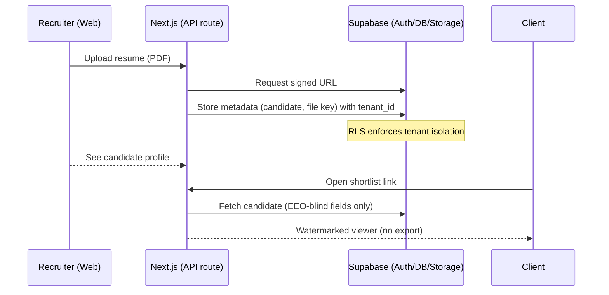
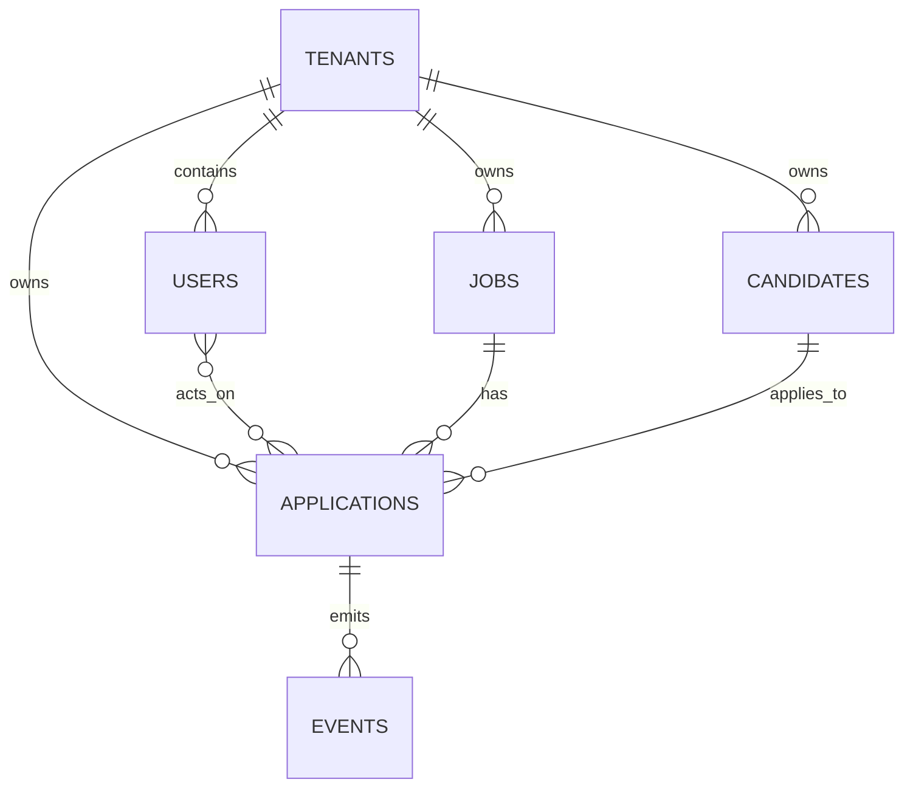

# 🏗️ Hire.io — System Architecture (MVP → Growth)

> **Version:** 1.0  
> **Pairs with:** [`docs/roadmap.md`](./roadmap.md)  
> **Audience:** Founders, engineers, AI coding agents (Bolt.new/GitHub Copilot)

This document explains *how* Hire.io is built and deployed from **MVP** through **Growth**. It includes:
- Component diagrams & request flows
- Data model & RLS (multi-tenant) patterns
- API surface (MVP routes) & eventing
- Environment variables & secrets
- Deployment, logging, backups, SLOs

---

## 1) High-Level Architecture

### 1.1 MVP (Bootstrap) — Minimal-Cost Stack
- **Frontend:** Next.js (App Router), Tailwind, shadcn/ui (Vercel)
- **Backend:** Next.js API routes for thin server logic
- **Data Platform:** Supabase (Postgres + Auth + Storage)
- **Search:** Postgres FTS (optional Meilisearch on Render)
- **AI:** OpenAI API (job intake Q&A, fit summaries)
- **Email:** Resend or SendGrid
- **Auth model:** Supabase Auth; JWT session; tenant scoped via `tenant_id`
- **Docs & CI:** `/docs` + GitHub Actions (lint/build/test)

```mermaid
flowchart LR
  A[Browser (Recruiter/Client)] -->|HTTPS| B[Next.js (Vercel)]
  B -->|API Routes| C[Supabase PostgREST/Edge]
  B -->|Signed URLs| D[Supabase Storage]
  B -->|REST| E[OpenAI API]
  B -->|SMTP/API| F[Resend/SendGrid]
  C <--> G[Postgres (RLS)]
```
> **Note:** Mermaid diagrams render in GitHub and many markdown viewers. In Bolt.new, keep as reference even if rendering is plain text.

### 1.2 Growth — Productionized Stack
- **Backend Services:** NestJS API (ECS/Fargate), background workers (BullMQ/Redis)
- **Search:** Meilisearch → OpenSearch (managed)
- **Analytics:** ClickHouse + Metabase (dashboards)
- **Storage/CDN:** S3 + CloudFront
- **Auth (Enterprise-ready):** Auth0/Cognito (later)
- **Observability:** APM + structured logs + metrics

```mermaid
flowchart LR
  A[Browser/Portals] --> B[Next.js (Vercel)]
  B --> C[NestJS API (ECS)]
  C --> D[RDS Postgres (RLS)]
  C --> E[Redis (Queues)]
  C --> F[OpenSearch]
  C --> G[S3 + CloudFront]
  C --> H[ClickHouse]
  C --> I[Resend/Twilio]
  C --> J[OpenAI/Azure OpenAI]
  subgraph Workers
    W1[Queue Workers] --> E
    W1 --> F
    W1 --> G
    W1 --> I
  end
```

---

## 2) Request/Response Flows (MVP)

### 2.1 Candidate Upload → EEO-Blind Client View



### 2.2 Job Intake Q&A (AI)
- Web calls a thin API route, which calls OpenAI with a structured prompt (job draft → improved JSON spec).
- Store the refined spec alongside the Job record.

---

## 3) Data Model (MVP)

### 3.1 Key Tables (simplified)

```
tenants(id, name, created_at)

users(id, tenant_id, role, email, name, created_at)

jobs(id, tenant_id, title, location, salary_min, salary_max,
     required_skills jsonb, nice_to_have jsonb, spec jsonb, created_by, created_at)

candidates(id, tenant_id, full_name, email, phone, location,
           skills jsonb, experience jsonb, resume_url, created_at)

applications(id, tenant_id, job_id, candidate_id, stage,
             score numeric, notes text, created_at)

events(id, tenant_id, actor_user_id, entity_type, entity_id,
       action, metadata jsonb, created_at)
```

> **Notes**
> - `tenant_id` on every table enforces isolation (RLS).
> - `skills/experience/spec` as `jsonb` for flexibility in MVP.
> - Add indexes on `tenant_id`, `job_id`, `candidate_id`, and frequently filtered columns.

### 3.2 Indices (examples)
```sql
create index on candidates (tenant_id);
create index on applications (tenant_id, job_id, candidate_id);
create index on jobs using gin ((spec));
create index on candidates using gin ((skills));
```

### 3.3 Example ERD (conceptual)


---

## 4) Row-Level Security (RLS) — Patterns

Enable RLS per table and gate by tenant + role.

```sql
-- Example: enable RLS
alter table candidates enable row level security;

-- Policy: only users from same tenant can select
create policy tenants_can_select_candidates
on candidates for select
using (tenant_id::text = auth.jwt() ->> 'tenant_id');

-- Policy: recruiters/admins can insert/update within tenant
create policy tenant_modify_candidates
on candidates for all
using (
  tenant_id::text = auth.jwt() ->> 'tenant_id'
  and (auth.jwt() ->> 'role') in ('admin','recruiter')
)
with check (
  tenant_id::text = auth.jwt() ->> 'tenant_id'
  and (auth.jwt() ->> 'role') in ('admin','recruiter')
);
```

> **JWT Claims (Supabase Auth)**
> - Include `tenant_id`, `role`, `user_id`.
> - Frontend sets these on login via Supabase Auth hooks.

---

## 5) API Surface (MVP)

> Thin Next.js API routes in `/app/api/*` that proxy to Supabase and external services with input validation (Zod).

### 5.1 Jobs
- `POST /api/jobs` → create job (AI assisted spec)
- `GET /api/jobs?query=` → list jobs
- `GET /api/jobs/:id` → job details + spec

### 5.2 Candidates
- `POST /api/candidates` → upsert candidate + signed upload URL
- `GET /api/candidates?skill=react` → filter
- `GET /api/candidates/:id` → detail (server filters PII for clients)

### 5.3 Applications
- `POST /api/applications` → link candidate to job
- `PATCH /api/applications/:id` → move stage, add notes
- `GET /api/jobs/:id/applications` → pipeline list

### 5.4 Search/Matching
- `POST /api/match` → payload: { jobId, leniency } → returns ranked candidates
- `POST /api/fit-summary` → payload: { job, candidate } → LLM narrative

### 5.5 Client Portal
- `GET /api/client/jobs/:id/shortlist` → EEO-blind list
- `POST /api/client/feedback` → approve/reject/request interview

> **Validation:** Use Zod schemas in `packages/schemas`.

---

## 6) Environment Variables (MVP)

Create `.env.local` (Vercel) and `.env` (local):

```
# Supabase
NEXT_PUBLIC_SUPABASE_URL=...
NEXT_PUBLIC_SUPABASE_ANON_KEY=...
SUPABASE_SERVICE_ROLE_KEY=...

# OpenAI
OPENAI_API_KEY=...

# Email
RESEND_API_KEY=...           # or SENDGRID_API_KEY

# App
NEXTAUTH_SECRET=...          # if NextAuth used
APP_BASE_URL=https://app.hire.io
```

> **Secrets:** Never commit. Use Vercel/Supabase secret managers.

---

## 7) Non-Functional Requirements

### 7.1 Security
- HTTPS everywhere, HSTS via Vercel
- JWT with `tenant_id` & `role` claims
- RLS enforced on every table
- Watermarked resume viewer; no raw downloads in client portal
- PII redaction in client-facing payloads

### 7.2 Observability (MVP → Growth)
- **MVP:** Supabase logs + Vercel function logs
- **Growth:** Centralized logs (Axiom/Datadog), metrics, error alerting, uptime checks

### 7.3 Performance Targets
- P95 page TTFB < 500ms (MVP)
- API P95 < 300ms for cached reads (Growth)
- Cold AI calls allowed up to 2–5s (UI spinners)

### 7.4 SLOs (initial)
- Uptime 99.5% (MVP), 99.9% (Growth)
- RPO ≤ 24h (MVP backups), ≤ 1h (Growth)
- RTO ≤ 24h (MVP), ≤ 2h (Growth)

---

## 8) Backups & DR

### MVP
- Supabase automated daily backups
- Weekly export of `jobs/candidates/applications` to storage (CSV/Parquet)
- Document restore playbook in `/docs/runbooks/backup-restore.md`

### Growth
- RDS snapshots (daily + PITR)
- S3 cross-region replication for resume files
- Infra-as-code (Terraform) for environment rebuilds

---

## 9) Search & Matching Details

### 9.1 MVP (Postgres FTS)
- Use `to_tsvector` on joined text (skills, titles)
- Simple rank + weights (required skills > nice-to-have)

### 9.2 Growth (Meilisearch/OpenSearch)
- Index: candidates (skills, titles, seniority, geo)
- Ranking rules:
  1. Required skills count
  2. Nice-to-have match
  3. Recency / last updated
- **Leniency Slider** maps to thresholds:
  - e.g. 0.8 strictness → must match N required skills

---

## 10) AI Interaction Contracts

### 10.1 Intake Calibration Prompt (summary)
- Inputs: draft job spec, company summary, location, constraints
- Output: normalized JSON:
  ```json
  {
    "title": "...",
    "location": "...",
    "salary_range": [0, 0],
    "required_skills": ["", ""],
    "nice_to_have": ["", ""],
    "experience_years": 3,
    "remote": "hybrid|onsite|remote",
    "notes": "..."
  }
  ```

### 10.2 Fit Narrative Prompt (summary)
- Inputs: normalized job spec + candidate profile
- Output: 3–5 paragraph rationale with bullet pros/cons

> **Guardrails:** Never return raw PII in client-facing mode.

---

## 11) Client Portal — EEO-Blind Controls

- **Server filtering:** strip `full_name`, email, phone, photo
- **UI viewer:** overlay watermark (`agency • client • timestamp`)
- **Links:** signed URLs with short TTL
- **Audit:** `events` row on every view/open

---

## 12) Deployment Plan

### 12.1 MVP
- **Vercel**: Next.js front + API routes
- **Supabase**: DB/Auth/Storage
- **Resend/SendGrid**: Email
- **OpenAI**: AI API

### 12.2 Growth
- **ECS/Fargate**: NestJS API & workers
- **RDS**: Postgres
- **Redis**: BullMQ queues
- **OpenSearch**: search
- **S3/CloudFront**: files
- **ClickHouse**: analytics
- **Terraform**: infra declarative

---

## 13) Acceptance Criteria (Phase Gates)

**MVP Done When:**
- [ ] Create agency → invite recruiter → create job
- [ ] Upload candidate → parse → add to pipeline
- [ ] Client can view shortlist in EEO-blind mode
- [ ] Leniency slider affects match results
- [ ] Fit summary renders for at least 5 test profiles
- [ ] Time-to-fill and stage counts render on dashboard
- [ ] Email notifications fire for 3 core events
- [ ] RLS verified: cross-tenant access blocked in tests

**Beta Done When:**
- [ ] Bulk upload/tagging, notes/@mentions
- [ ] Calendar scheduling works (GCal/M365)
- [ ] Meilisearch integrated; saved searches + alerts
- [ ] Recruiter KPI dashboards live
- [ ] Branding + custom subdomains configured

---

## 14) Open Questions / Future Notes
- Background checks (Checkr) timeline & pricing
- Job board partner approvals (LinkedIn/Indeed) lead time
- Decision: Meilisearch vs OpenSearch at Growth
- Analytics strategy: ClickHouse cloud vs BigQuery

---

## 15) Quick Start (Dev)

```
pnpm i
cp apps/web/.env.example apps/web/.env.local
# fill Supabase/OpenAI keys

pnpm dev
# opens web on http://localhost:3000
```

- **Seed script:** `scripts/seed-dev.ts` (tenants, jobs, candidates)
- **Test accounts:** added by seed; passwords in local `.env`

---

## 16) Glossary

- **EEO-Blind:** Anonymized candidate display to reduce bias.
- **Leniency Slider:** UI control that relaxes/tightens match constraints.
- **Pool Gauge:** Visual indicator of available candidates under current filters.
- **RLS:** Row-Level Security; DB-enforced tenant isolation.

---
